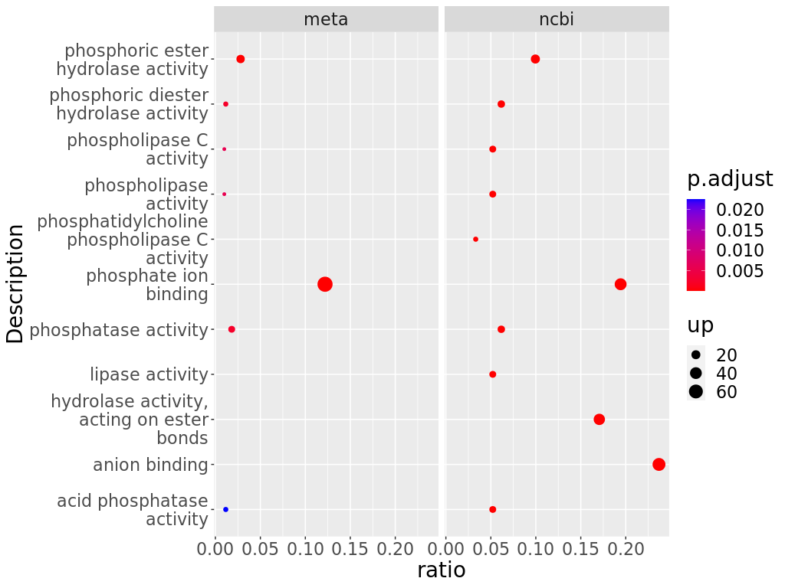
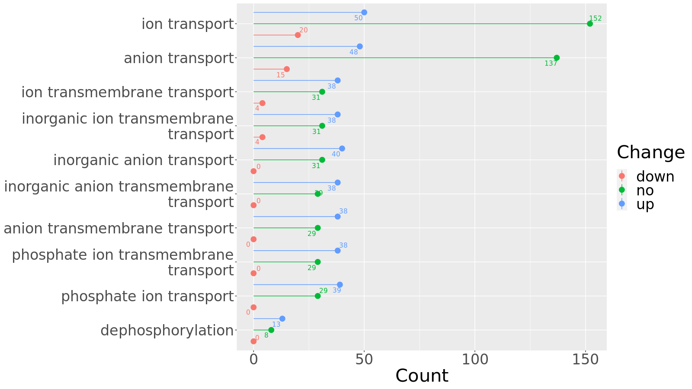

A Tale of Two Databases 📚
================
Yi Xiong
2020/11/25

  - The Meta DB and the Public DB can both perform well in soil
    proteomics 😊

  - Meta proteomics analysis pipeline based on Proteome Discovery output
    💡

  - Xiong Yi, Zheng Lu, Meng Xiangxiang, et al. Protein sequence databases generated from metagenomics  and public database produced similar soil metaproteomic results of           microbial taxonomic and functional changes. Pedosphere, 2021 ✌️
    
      - Reproduce this study

<!-- end list -->

``` bash
mkdir Proteomics
cd Proteomics
git clone https://github.com/xyz1396/Meta-proteomics-analysis-pipeline-based-on-Proteome-Discovery-output
# Run the rmd files in Rstudio
```

  - data:
    
      - input dataset used in this study (large files like database in
        fasta and blast XML file are ignorged)

  - figure:
    
      - output pictures used in the paper

  - script:
    
      - rmd files storing the code to analyze the data

  - table:
    
      - output tables used in the paper

  - temp:
    
      - temporary files generated in this study

<!-- end list -->

1)  [Download mass spectral data and build
    databases](script/Download%20mass%20spectral%20data%20and%20build%20databases.Rmd)

2)  [Calculate the protein sequence length of the two databases in
    detail](script/Calculate%20the%20protein%20sequence%20length%20of%20the%20two%20databases%20in%20detail.Rmd)

3)  [Get Identified proteins, Coverage, Length, UpsetR,
    Venn](script/Get%20Identified%20proteins,%20Coverage,%20Length,%20UpsetR,%20Venn.Rmd)


``` 
 compare length of identified proteins  
```

4)  [Volcano Plot](script/Volcano%20Plot.Rmd)


``` 
Meta DB VolcanoPlot  
```

5)  [Statistical comparison of microbial species identified by the two
    databases](script/Statistical%20comparison%20of%20microbial%20species%20identified%20by%20the%20two%20databases.rmd)


    Correlation of abundance identified by the two databases in LP with histogram 

6)  [KEGG level3 annotation statistics of the two
    databases](script/KEGG%20level3%20annotation%20statistics%20of%20the%20two%20databases.Rmd)


    Correlation of KEGG level3 identified by the two databases in HP with histogram 

7)  [Summary statistics of
    annotations](script/Summary%20statistics%20of%20annotations.Rmd)


    Summary statistics of protein annotations 

8)  [Enrichment analysis](script/Enrichment%20analysis.Rmd)



    Enrichment analysis results 

9)  [Draw phosphatase and phosphatase evolutionary tree and add species
    annotation](script/Draw%20phosphatase%20and%20phosphatase%20evolutionary%20tree%20and%20add%20species%20annotation.rmd)

10) [All identified proteins’s
    heatmap](script/All%20identified%20proteins's%20heatmap.Rmd)


    The heatmap of abundance of protein identified by the Meta DB 

11) [Blast the protein sequences identified by the 2 databases to each
    other](script/Blast%20the%20protein%20sequences%20identified%20by%20the%202%20databases%20to%20each%20other.rmd)


    Percentage of identical matches 

12) [Statistical comparison of PSMs of microbial species identified by
    the two
    databases](script/Statistical%20comparison%20of%20PSMs%20of%20microbial%20species%20identified%20by%20the%20two%20databases.rmd)


    PSMs of genera identified only by Meta DB and both DB 

13) [GO annotations of proteins with significantly differential
    abundance identified by the 2 DBs For Fig.
    S7](script/GO%20annotations%20of%20proteins%20with%20significantly%20differential%20abundance%20identified%20by%20the%202%20DBs.rmd)



    The amount of proteins with significantly differential abundance identified by the Public DB
