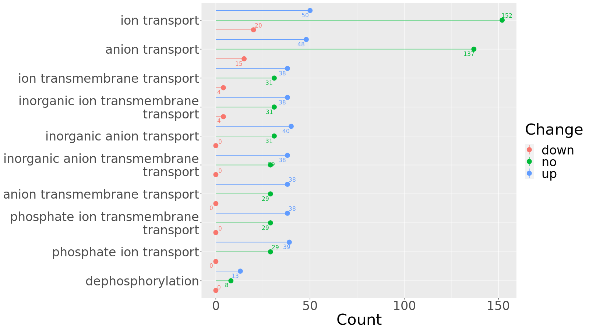

```{r setup, include=FALSE}
knitr::opts_chunk$set(echo = TRUE)
```

* The Meta DB and the Public DB can both perform well in soil proteomics 😊

* Meta proteomics analysis pipeline based on Proteome Discovery output 💡

* Protein Sequence Databases Generated from Metagenomes and the Public Database Reveal Similar Microbial Taxonomic and Functional Changes in Soil Metaproteomics. XIONG Y, ZHENG L, MENG XX, SHEN RF, LAN P. (in review) 🕐

    - Reproduce this study
    
```{bash,eval=F}
mkdir Proteomics
cd Proteomics
git clone https://github.com/xyz1396/Meta-proteomics-analysis-pipeline-based-on-Proteome-Discovery-output
# Run the rmd files in Rstudio
```

* data:  
  
    - input dataset used in this study (large files like database in fasta and blast XML file are ignorged) 
    
* figure:  
  
    - output pictures used in the paper
    
* script:  
  
    - rmd files storing the code to analyze the data
    
* table:  
  
    - output tables used in the paper
  
* temp:  
  
    - temporary files generated in this study  

(@) [Download mass spectral data and build databases](script/Download mass spectral data and build databases.Rmd)

(@) [Calculate the protein sequence length of the two databases in detail](script/Calculate the protein sequence length of the two databases in detail.Rmd)

(@) [Get Identified proteins, Coverage, Length, UpsetR, Venn](script/Get Identified proteins, Coverage, Length, UpsetR, Venn.Rmd)

  
     
     compare length of identified proteins  
  
(@) [Volcano Plot](script/Volcano Plot.Rmd)

  
    
    Meta DB VolcanoPlot  
  
(@) [Statistical comparison of microbial species identified by the two databases](script/Statistical comparison of microbial species identified by the two databases.rmd)


    
    Correlation of abundance identified by the two databases in LP with histogram 
    
(@) [KEGG level3 annotation statistics of the two databases](script/KEGG level3 annotation statistics of the two databases.Rmd)


    
    Correlation of KEGG level3 identified by the two databases in HP with histogram 
  
(@) [Summary statistics of annotations](script/Summary statistics of annotations.Rmd)


    
    Summary statistics of protein annotations 
    
(@) [Enrichment analysis](script/Enrichment analysis.Rmd)
  

    
    Enrichment analysis results 

(@) [Draw phosphatase and phosphatase evolutionary tree and add species annotation](script/Draw phosphatase and phosphatase evolutionary tree and add species annotation.rmd)


(@) [All identified proteins's heatmap](script/All identified proteins's heatmap.Rmd)

 
    
    The heatmap of abundance of protein identified by the Meta DB 

(@) [Blast the protein sequences identified by the 2 databases to each other](script/Blast the protein sequences identified by the 2 databases to each other.rmd)


    
    Percentage of identical matches 

(@) [Statistical comparison of PSMs of microbial species identified by the two databases](script/Statistical comparison of PSMs of microbial species identified by the two databases.rmd)


    
    PSMs of genera identified only by Meta DB and both DB 

(@) [GO annotations of proteins with significantly differential abundance identified by the 2 DBs For Fig. S7](script/GO annotations of proteins with significantly differential abundance identified by the 2 DBs.rmd)


    
    The amount of proteins with significantly differential abundance identified by the Public DB


